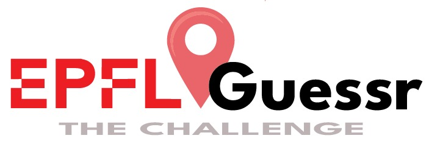

# UDT Game — EPFLGuessr



This game project is part of the construction of an EPFL *Digital Twin* within the class **URB-410 Urban digital twins**.

**Group members**: Rayane Kadiri Hassani, Philip Ojas Ramabadran, Maxime Steiner

LLM used for prototyping, vibe coding and structuring the project: *GPT-5.2-Codex & Claude Sonnet 4.6*


**3 objectives guiding our work**:
1. A multiplayer game that will help collect valuable data for the development of the digital twin
2. A flexible implementation to collect targeted data as needed
3. A smooth and intuitive user experience that "gamifies" scanning of the campus, utilizing individually taken images
 
---

## General concept

```
Gameplay for users
1. Everyday before 12 noon, players can take pictures of the campus in the app and submit them to challenge their friends
       ↓
2. Everyday at 12 noon, players can see all the pictures that were made and need to find information about them to earn points
       ↓
3. Ways to get points are mainly: take the same picture (at the same location) and pin picture location on the map
       ↓
4. The amount of points gained by players is ajusted to encourage campus scanning where the twin most need it
(e.g. points x3 if the picture is taken in the Rolex Learning Center, or +100 points if no pictures was taken inside this building before, ...)
       ↓
5. In addition to the daily challenge, users can also play a weekly challenge with a similar gameplay
(allows to collect more focussed data, e.g. food, affluence, ...)
```

All the geolocated photos of the outside and inside of the campus that are captured are stored in an internal SQLite Database to feed the twin. Complementary projects lead by other students are then supposed to use these pictures to extract information or to model campus using photogrammetry.

---

## Current state of the project

| Feature | Status |
|----------------|------|
| Basic interactive EPFL map (Leaflet + OSM) | ✅ Done |
| Real-time geolocation of users and pictures | ✅ Done |
| Taking pictures (mobile + desktop) | ✅ Done |
| Daily notification | To be adapted |
| Multiplayer synchronization (WebSocket) | ✅ Done |
| Persisting SQLite Database | ✅ Done |
| Game configuration script | ✅ Done |
| Pipeline for submitting pictures | 🔧 To be implemented |
| Pipeline for guessing and re-picture | 🔧 To be implemented |
| Criteria to validate pictures | To be defined and implemented |
| Easy config of the game | 🔧 To be designed |
| Global storing system | 🔧 To be implemented |

 

### Expected Deliverables:
```
- Deployed prototype of the WebApp 
- Criteria for validation / design of scoring/”reward” logic 
- Interface for mobile usage (+ tests on own devices) 
- Storage logic for output imagery (in accordance with other groups) 
- Data input logic for weekly challenge extension 
```

### Indicative timeline: 

| **date** | progress |
|----|------|
| **until 01.04.2026** | Basic pap structure, geo-localisation function, multiplayer synchronisation, storage of images |
| **09.04.2026** | Graphic output, clarified spatial structure (levels), logic of scoring/rewarding implemented |
| **16.04.2026** | Game ready to be deployed using Render/Railway/Heroku |
| **23.04.2026** | Mobile interface mock-up |

---

## How to start the game (launching instruction)

### Prerequisite
- Node.js installed → v24.14.1 (LTS)

### Launching game in dev mode (web interface + API server)
```cmd
npm install
npm run dev:full
```

- Web Interface → `http://localhost:5173`
- API Server → `http://localhost:3001`

### Available Commands
| Command | Purpose |
|----------|------|
| `npm run dev:full` | Launching Node Server + Vite at the same time |
| `npm run dev` | Launching Vite only (interface) |
| `npm run server` | Launching Node Server only |
| `npm run build` | Compile for production |

---

## Architecture

```
UDT_game/
│
├── game/                          ← GAME SCRIPT (edit to change rules)
│   ├── game-config.js             ← Schedule, daily locations, active mini-games, scores
│   └── epfl-locations.js          ← Database of 7 recognizable EPFL locations
│
├── src/
│   ├── client/                    ← Browser code (Vite / vanilla JS)
│   │   ├── app/
│   │   │   ├── bootstrap.js       ← Entry point: wires all modules together
│   │   │   └── state.js           ← Shared global state (map, GPS)
│   │   │
│   │   ├── map/
│   │   │   ├── map-config.js      ← Centering, zoom, EPFL map boundaries
│   │   │   └── map-view.js        ← Creates the Leaflet map
│   │   │
│   │   ├── camera/
│   │   │   ├── camera-controller.js  ← Orchestrates open/capture/save
│   │   │   └── camera-overlay.js     ← Camera UI overlay
│   │   │
│   │   ├── gallery/
│   │   │   └── gallery-view.js    ← Panel listing captured photos
│   │   │
│   │   ├── overlays/
│   │   │   ├── time-overlay.js         ← Clock, timer, notification buttons
│   │   │   ├── user-location-layer.js  ← User GPS marker on the map
│   │   │   └── photo-markers-layer.js  ← Photo markers on the map
│   │   │
│   │   ├── minigames/             ← One folder per mini-game (UI to implement)
│   │   │   ├── geo-pin/
│   │   │   │   └── geo-pin-ui.js       ← [stub] Pin the location on the map
│   │   │   ├── re-photo/
│   │   │   │   └── re-photo-ui.js      ← [stub] Return to the location and retake photo
│   │   │   └── time-guess/
│   │   │       └── time-guess-ui.js    ← [stub] Guess the time the photo was taken
│   │   │
│   │   └── services/
│   │       ├── notification-scheduler.js  ← Schedules daily notifications
│   │       ├── photo-store.js             ← Local photo storage (IndexedDB)
│   │       ├── photo-sync.js              ← Sync photos with server (REST + WebSocket)
│   │       └── geolocation.js             ← Real-time GPS
│   │
│   └── server/                    ← Node.js server (Express + WebSocket + SQLite)
│       ├── index.js               ← REST API routes + WebSocket
│       └── db.js                  ← Local SQLite database
│
├── data/
│   └── photos.db                  ← SQLite database (auto-created, git-ignored)
│
├── index.html                     ← Main HTML page
├── vite.config.js                 ← Vite config (LAN access enabled)
└── package.json
```

---

## Database (SQLite)

The file `data/photos.db` is created automatically on first launch.

| Table         | Role                                          |
| ------------- | --------------------------------------------- |
| `photos`      | All captured photos (dataUrl, GPS, timestamp) |
| `challenges`  | Daily challenges (1 target location per day)  |
| `submissions` | Photos submitted for a challenge              |
| `guesses`     | Player answers to mini-games + scores         |

---

## REST API

| Method | Route                       | Description                     |
| ------ | --------------------------- | ------------------------------- |
| `GET`  | `/api/photos`               | All photos                      |
| `POST` | `/api/photos`               | Submit a photo                  |
| `GET`  | `/api/challenge/today`      | Today’s challenge               |
| `POST` | `/api/challenge/:id/submit` | Link a photo to a challenge     |
| `POST` | `/api/guess`                | Submit an answer to a mini-game |
| `GET`  | `/api/guess/:photoId`       | Scores for a photo              |

---

## Configure the Game — `game/game-config.js`

This is **the only file to edit** to change the game behavior without modifying the code.

### Change notification time

```js
export const DAILY_SCHEDULE = [
  { hour: 12, minute: 0, label: 'Noon mission' },
  // { hour: 18, minute: 30, label: 'Evening mission' },  // uncomment to enable
];
```

### Change the target location by day of the week

```js
export const LOCATION_BY_WEEKDAY = {
  1: 'rolex',       // Monday   → Rolex Learning Center
  2: 'bc',          // Tuesday  → BC Library
  3: 'esplanade',   // Wednesday→ Central Esplanade
  // ...
};
```

### Enable / disable a mini-game

```js
export const MINIGAMES = {
  geoPin:    { active: true,  ... },
  rePhoto:   { active: false, ... },  // disabled
  timeGuess: { active: true,  ... },
};
```


